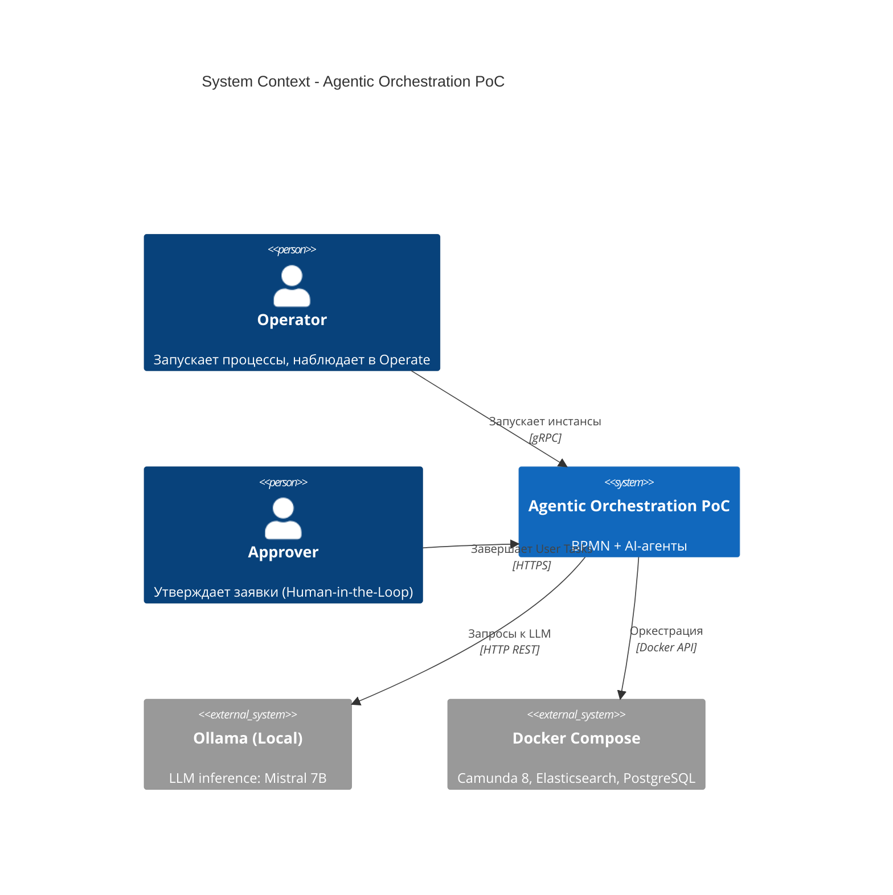
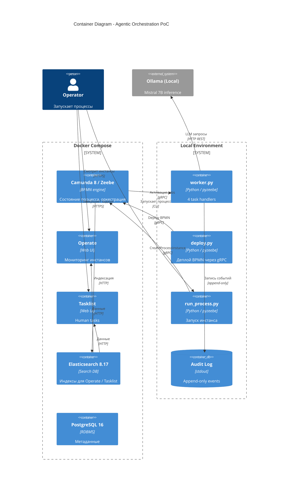
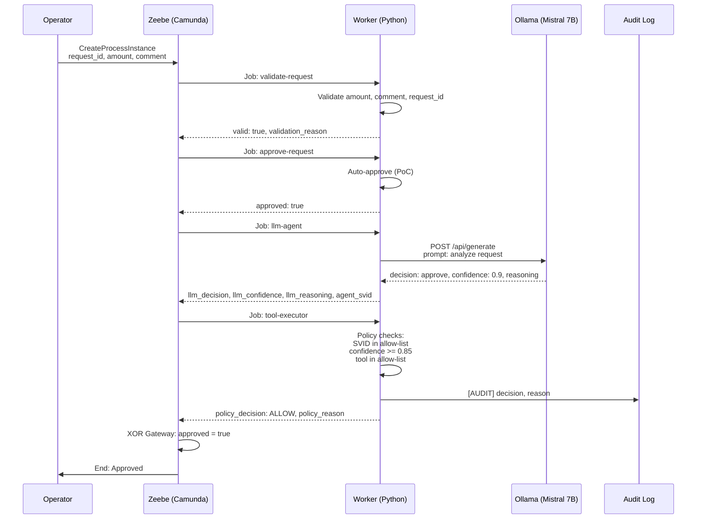

## Что демонстрирует PoC

- **Гибридная оркестрация** — Camunda 8 (BPMN) + локальная LLM (Ollama)
- **Human-in-the-Loop** — User Task с auto-approve для PoC
- **LLM-as-a-Service** — Mistral 7B, локально, без внешних API
- **Policy Enforcement Point** — RBAC + confidence threshold
- **WIMSE-идентичность** — `agent_svid` для агентов
- **Append-only audit** — каждое решение с reasoning
- **Структурированный вывод LLM** — JSON (decision, confidence, reasoning)

---

## C4 Model Diagrams

### Level 1 — System Context

Кто использует систему и какие внешние зависимости существуют.



### Level 2 — Container

Что развёрнуто и как компоненты общаются.



---

## Sequence Diagram — Полный цикл



---

## Alignment with Blueprint

| Blueprint Section | Implementation in PoC |
|-------------------|----------------------|
| **3.2 A2A Protocol** | `RecommendationDTO` (Pydantic) - формальный контракт агента |
| **3.3 Human-in-the-Loop** | User Task `approve-request` (replaced by Service Task for PoC) |
| **3.6.1 LLM as a Service** | `llm-agent` handler с Ollama Mistral 7B |
| **3.7 State Management** | Camunda 8 BPMN process |
| **4.1 Agent Policies** | `tool-executor` handler: RBAC + confidence threshold |
| **4.2 WIMSE Identity** | `agent_svid` в RecommendationDTO + white-list validation |
| **4.3 Immutable Audit** | `[AUDIT]` log с reasoning, append-only |

---

## Verified Scenarios

### Scenario 1: Confidence = 0.9 (ALLOW)

LLM ответ:
```json
{
  "decision": "approve",
  "confidence": 0.9,
  "reasoning": "The procurement committee has analyzed the request..."
}
```

Policy Engine:
```
[tool-executor] Policy decision: ALLOW
[tool-executor] Reason: SVID OK; Confidence OK (0.90); Tool OK (send-notification)
```

Результат: процесс завершён -> **End: Approved** за 42 секунды.

### Scenario 2: Confidence = 0.8 (DENY)

LLM ответ:
```json
{
  "decision": "approve",
  "confidence": 0.8,
  "reasoning": "The procurement committee has reviewed the request..."
}
```

Policy Engine:
```
[tool-executor] Policy decision: DENY
[tool-executor] Reason: SVID OK; Confidence 0.80 < threshold 0.85; Tool OK; LLM approved but confidence below threshold
```

Результат: рекомендация отклонена -> эскалация на человека (в будущей версии - User Task `manual-review`).

---

## Tech Stack

| Layer | Technology |
|-------|-----------|
| **BPMN Engine** | Camunda 8.8 (Zeebe + Operate + Tasklist) |
| **Search** | Elasticsearch 8.17 |
| **Metadata DB** | PostgreSQL 16 |
| **Workers** | Python 3.11, pyzeebe 4.0.0rc5, asyncio, httpx |
| **Validation** | Pydantic 2.9.2 |
| **LLM** | Ollama + Mistral 7B (local, no external API) |
| **Orchestration** | Docker Compose profiles |

---

## Setup

### Prerequisites

- Docker Desktop >= 4.89 (Compose v5+)
- >= 8 GB RAM для Docker
- Ollama локально с моделью Mistral 7B (`ollama pull mistral:7b-instruct-q4_K_M`)
- Python 3.11+

### 1. Запустить инфраструктуру

```powershell
docker compose --profile core up -d
docker compose --profile core ps
```

Дождаться `healthy` для всех трёх контейнеров (~2-3 минуты).

### 2. Установить зависимости

```powershell
cd workers
python -m venv .venv
.\\.venv\\Scripts\\Activate.ps1
pip install -r requirements.txt
```

### 3. Задеплоить BPMN

```powershell
python deploy.py
```

Ожидаемый вывод:
```
Deployed successfully:
  processes=[ProcessMetadata(bpmn_process_id='poc-procurement-process', version=3, ...)]
```

### 4. Запустить воркер

```powershell
python worker.py
```

Ожидаемый вывод:
```
Worker started. Listening for tasks:
  - validate-request
  - approve-request
  - llm-agent (model: mistral:7b-instruct-q4_K_M)
  - tool-executor (Policy Enforcement Point)
```

### 5. Запустить инстанс (в другом окне)

```powershell
python run_process.py
```

### 6. Проверить в Operate

Открыть [http://localhost:8888/operate](http://localhost:8888/operate) - логин `demo` / пароль `demo`.

**Processes** -> `PoC Procurement Process` -> инстанс должен быть **Completed**.

---

## Repository Structure

```
agentic-orchestration-poc/
|-- README.md                    # Этот файл
|-- docker-compose.yml           # Инфраструктура
|-- .env.example                 # Переменные окружения
|-- .gitignore
|-- bpmn/
|   +-- process.bpmn             # BPMN-процесс
|-- workers/
|   |-- worker.py                # 4 task handlers (Python)
|   |-- deploy.py                # Скрипт деплоя BPMN
|   |-- run_process.py           # Скрипт запуска инстанса
|   |-- tool_contract.py         # RecommendationDTO (Pydantic)
|   |-- create_readme.py         # Этот скрипт
|   +-- requirements.txt
|-- mcp/                         # (planned) MCP Gateway
|-- docs/                        # (planned) C4 Level 3
+-- infra/
    +-- postgres-init.sh         # Init БД
```

---

## Key Decisions

- **Порт 8888** для Camunda - потому что 8080 занят локальным Tomcat.
- **Elasticsearch 8.17** - Camunda 8.8 требует ES 8.17+.
- **Unified config** - `CAMUNDA_DATA_SECONDARYSTORAGE_ELASTICSEARCH_URL`.
- **Basic auth (demo/demo)** - Camunda 8.8 не поддерживает `none`.
- **Mistral 7B** - instruction-tuned, JSON output, локально без внешних API.
- **Service Task вместо User Task** - для PoC, потому что Tasklist требует форму.
- **Ollama на хосте** (не в Docker) - прямой доступ к GPU, быстрее.

---

## Known Issues

- **pyzeebe JobNotFoundError** - при долгом первом вызове LLM (~60 сек на загрузку модели) задача активируется с retry. Не ломает процесс. Решение: "прогреть" модель перед запуском.
- **Tasklist не показывает User Task без формы** - в Camunda 8.8. Требуется создать Camunda Form через Web Modeler.

---

## Roadmap

- [ ] MCP Gateway - стандартизированный слой интеграции с legacy
- [ ] User Task с Camunda Form - Human-in-the-Loop для эскалации
- [ ] Расширенный Policy - лимиты по сумме, региону, tool_name
- [ ] Observability - Jaeger (tracing), Langfuse (LLM observability)
- [ ] Реальные Tools - `send-notification` через HTTP
- [ ] Расширенный Audit Log - PostgreSQL с hash-цепочкой

---

## Integration with MCP Gateway

The process integrates with [mcp-gateway-poc](https://github.com/realrvs/mcp-gateway-poc) via Service Task `mcp-gateway`:

- MCP transport: SSE + JSON-RPC 2.0
- RBAC via X-Agent-SVID header
- Tool: `publish_notice` (EIS mock)
- Audit log in mcp-postgres

**Verified Result:**
- `mcp_status` = `SUCCESS`
- `mcp_notice_id` = `EIS-2026-MOSCOW-5679`
- `mcp_message` = "Закупка ... успешно зарегистрирована"

- **Blueprint:** [github.com/realrvs/enterprise-agent-orchestration-blueprint](https://github.com/realrvs/enterprise-agent-orchestration-blueprint)
- **Reference implementation (Day 1-5):** [github.com/realrvs/camunda](https://github.com/realrvs/camunda)
